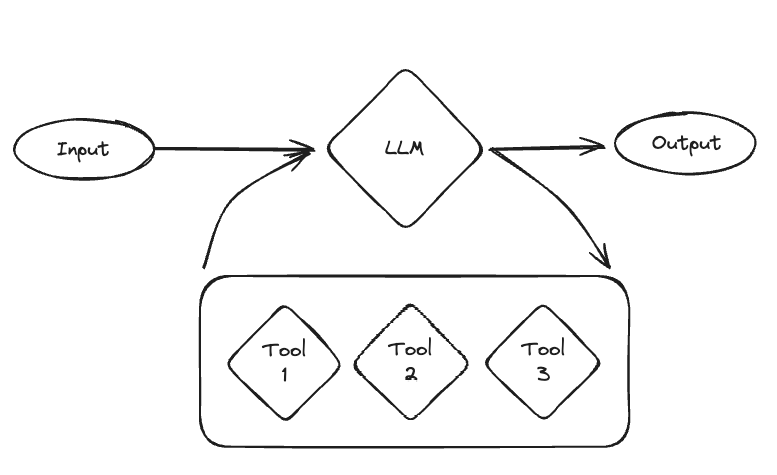
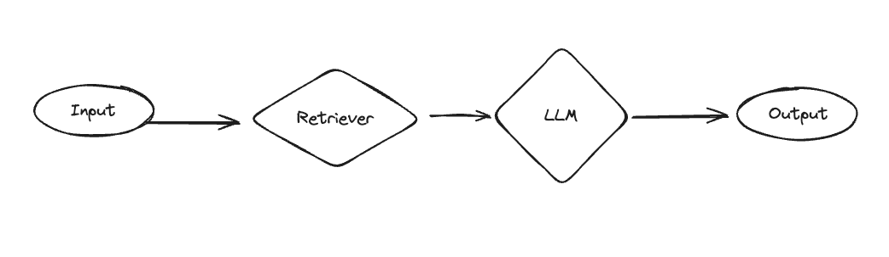
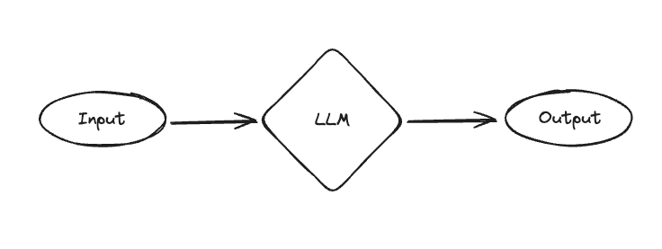

# OpenGPTs

This is an open source effort to create a similar experience to OpenAI's GPTs and Assistants API.
It is powered by [LangGraph](https://github.com/langchain-ai/langgraph) - a framework for creating agent runtimes.
It also builds upon [LangChain](https://github.com/langchain-ai/langchain), [LangServe](https://github.com/langchain-ai/langserve) and [LangSmith](https://smith.langchain.com/).
OpenGPTs gives you more control, allowing you to configure:

- The LLM you use (choose between the 60+ that LangChain offers)
- The prompts you use (use LangSmith to debug those)
- The tools you give it (choose from LangChain's 100+ tools, or easily write your own)
- The vector database you use (choose from LangChain's 60+ vector database integrations)
- The retrieval algorithm you use
- The chat history database you use

Most importantly, it gives you full control over the **cognitive architecture** of your application.
Currently, there are three different architectures implemented:

- Assistant
- RAG
- Chatbot

See below for more details on those.
Because this is open source, if you do not like those architectures or want to modify them, you can easily do that!

<p align="center">
    
    
</p>

**Key Links**

- [GPTs: a simple hosted version](https://opengpts-example-vz4y4ooboq-uc.a.run.app/)
- [Assistants API: a getting started guide](API.md)
- [Auth: a guide for production](auth.md)

## Quickstart with Docker

This project supports a Docker-based setup, streamlining installation and execution. It automatically builds images for 
the frontend and backend and sets up Postgres using docker-compose.


1. **Prerequisites:**  
    Ensure you have Docker and docker-compose installed on your system.


2. **Clone the Repository:**  
   Obtain the project files by cloning the repository.

   ```
   git clone https://github.com/langchain-ai/opengpts.git
   cd opengpts
   ```

3. **Set Up Environment Variables:**  
   Create a `.env` file in the root directory of the project by copying `.env.example` as a template, and add the 
   following environment variables:
   ```shell
   # At least one language model API key is required
   OPENAI_API_KEY=sk-...
   # LANGCHAIN_TRACING_V2=true
   # LANGCHAIN_API_KEY=...
   
   # Setup for Postgres. Docker compose will use these values to set up the database.
   POSTGRES_PORT=5432
   POSTGRES_DB=opengpts
   POSTGRES_USER=postgres
   POSTGRES_PASSWORD=...
   ```

   Replace `sk-...` with your OpenAI API key and `...` with your LangChain API key.


4. **Run with Docker Compose:**  
   In the root directory of the project, execute:

   ```
   docker compose up
   ```

   This command builds the Docker images for the frontend and backend from their respective Dockerfiles and starts all 
   necessary services, including Postgres.

5. **Access the Application:**  
   With the services running, access the frontend at [http://localhost:5173](http://localhost:5173), substituting `5173` with the 
   designated port number.


6. **Rebuilding After Changes:**  
   If you make changes to either the frontend or backend, rebuild the Docker images to reflect these changes. Run:
   ```
   docker compose up --build
   ```
   This command rebuilds the images with your latest changes and restarts the services.


## Quickstart without Docker

**Prerequisites**
The following instructions assume you have Python 3.11+ installed on your system. We strongly recommend using a virtual 
environment to manage dependencies.

For example, if you are using `pyenv`, you can create a new virtual environment with:
```shell
pyenv install 3.11
pyenv virtualenv 3.11 opengpts
pyenv activate opengpts
```

Once your Python environment is set up, you can install the project dependencies:

The backend service uses [poetry](https://python-poetry.org/docs/#installation) to manage dependencies.
It assumes libmagic to be [installed](https://github.com/ahupp/python-magic?tab=readme-ov-file#installation) in your 
host system.

```shell 
pip install poetry
pip install libmagic
pip install langchain-community
brew install libmagic
```

**Install Postgres and the Postgres Vector Extension**
```
brew install postgresql pgvector
brew services start postgresql
```

**Configure persistence layer**

The backend uses Postgres for saving agent configurations and chat message history.
In order to use this, you need to set the following environment variables:

```shell
export POSTGRES_HOST=localhost
export POSTGRES_PORT=5432
export POSTGRES_DB=opengpts
export POSTGRES_USER=postgres
export POSTGRES_PASSWORD=...
```

**Create the database**
```shell
createdb opengpts
```

**Connect to the database and create the `postgres` role**
```shell
psql -d opengpts
```

```sql
CREATE ROLE postgres WITH LOGIN SUPERUSER CREATEDB CREATEROLE;
```

**Install Golang Migrate**

Database migrations are managed with [golang-migrate](https://github.com/golang-migrate/migrate). 

On MacOS, you can install it with `brew install golang-migrate`. Instructions for other OSs or the Golang toolchain, 
can be found [here](https://github.com/golang-migrate/migrate/blob/master/cmd/migrate/README.md#installation).

Once `golang-migrate` is installed, you can run all the migrations with:
```shell
make migrate
```

This will enable the backend to use Postgres as a vector database and create the initial tables.


**Install backend dependencies**
```shell
cd backend
poetry install
```


**Alternate vector databases**

The instructions above use Postgres as a vector database,
although you can easily switch this out to use any of the 50+ vector databases in LangChain.

**Set up language models**

By default, this uses OpenAI, but there are also options for Azure OpenAI and Anthropic.
If you are using those, you may need to set different environment variables.

```shell
export OPENAI_API_KEY="sk-..."
```

Other language models can be used, and in order to use them you will need to set more environment variables.
See the section below on `LLMs` for how to configure Azure OpenAI, Anthropic, and Amazon Bedrock.

**Set up tools**

By default this uses a lot of tools.
Some of these require additional environment variables.
You do not need to use any of these tools, and the environment variables are not required to spin up the app
(they are only required if that tool is called).

For a full list of environment variables to enable, see the `Tools` section below.

**Set up monitoring**

Set up [LangSmith](https://smith.langchain.com/).
This is optional, but it will help with debugging, logging, monitoring.
Sign up at the link above and then set the relevant environment variables

```shell
export LANGCHAIN_TRACING_V2="true"
export LANGCHAIN_API_KEY=...
```

Start the backend server

```shell
make start
```

### Start the frontend

```shell
cd frontend
npm install
npm run dev
```

Navigate to [http://localhost:5173/](http://localhost:5173/) and enjoy!

## Migrating data from Redis to Postgres

Refer to this [guide](tools/redis_to_postgres/README.md) for migrating data from Redis to Postgres.

## Features

As much as possible, we are striving for feature parity with OpenAI.

- [x] Sandbox - Provides an environment to import, test, and modify existing chatbots.
  - The chatbots used are all in code, so are easily editable
- [x] Custom Actions - Define additional functionality for your chatbot using OpenAPI specifications
  - Supported by adding tools
- [x] Knowledge Files - attach additional files that your chatbot can reference
  - Upload files from the UI or API, used by Retrieval tool
- [x] Tools - Provides basic tools for web browsing, image creation, etc.
  - Basic DuckDuckGo and PythonREPL tools enabled by default
  - Image creation coming soon
- [x] Analytics - View and analyze chatbot usage data
  - Use LangSmith for this
- [x] Drafts - Save and share drafts of chatbots you're creating
  - Supports saving of configurations
- [x] Publishing - publicly distribute your completed chatbot
  - Can do by deploying via LangServe
- [x] Sharing - Set up and manage chatbot sharing
  - Can do by deploying via LangServe
- [ ] Marketplace - Search and deploy chatbots created by other users
  - Coming soon

## Repo Structure

- `frontend`: Code for the frontend
- `backend`: Code for the backend
  - `app`: LangServe code (for exposing APIs)
  - `packages`: Core logic
    - `agent-executor`: Runtime for the agent
    - `gizmo-agent`: Configuration for the agent

## Customization

The big appeal of OpenGPTs as compared to using OpenAI directly is that it is more customizable.
Specifically, you can choose which language models to use as well as more easily add custom tools.
You can also use the underlying APIs directly and build a custom UI yourself should you choose.

### Cognitive Architecture

This refers to the logic of how the GPT works.
There are currently three different architectures supported, but because they are all written in LangGraph, it is very 
easy to modify them or add your own.

The three different architectures supported are assistants, RAG, and chatbots.

**Assistants**

Assistants can be equipped with arbitrary amount of tools and use an LLM to decide when to use them. This makes them 
the most flexible choice, but they work well with fewer models and can be less reliable.

When creating an assistant, you specify a few things.

First, you choose the language model to use. Only a few language models can be used reliably well: GPT-3.5, GPT-4, 
Claude, and Gemini.

Second, you choose the tools to use. These can be predefined tools OR a retriever constructed from uploaded files. You 
can choose however many you want.

The cognitive architecture can then be thought of as a loop. First, the LLM is called to determine what (if any) 
actions to take. If it decides to take actions, then those actions are executed and it loops back. If no actions are 
decided to take, then the response of the LLM is the final response, and it finishes the loop.



This can be a really powerful and flexible architecture. This is probably closest to how us humans operate. However, 
these also can be not super reliable, and generally only work with the more performant models (and even then they can 
mess up). Therefore, we introduced a few simpler architecures.

Assistants are implemented with [LangGraph](https://github.com/langchain-ai/langgraph) `MessageGraph`. A `MessageGraph` is a graph that models its state as a `list` of messages.

**RAGBot**

One of the big use cases of the GPT store is uploading files and giving the bot knowledge of those files. What would it 
mean to make an architecture more focused on that use case?

We added RAGBot - a retrieval-focused GPT with a straightforward architecture. First, a set of documents are retrieved. 
Then, those documents are passed in the system message to a separate call to the language model so it can respond.

Compared to assistants, it is more structured (but less powerful). It ALWAYS looks up something - which is good if you 
know you want to look things up, but potentially wasteful if the user is just trying to have a normal conversation. 
Also importantly, this only looks up things once - so if it doesn’t find the right results then it will yield a bad 
result (compared to an assistant, which could  decide to look things up again).



Despite this being a more simple architecture, it is good for a few reasons. First, because it is simpler it can work 
pretty well with a wider variety of models (including lots of open source models). Second, if you have a use case where 
you don’t NEED the flexibility of an assistant (eg you know users will be looking up information every time) then it 
can be more focused. And third, compared to the final architecture below it can use external knowledge.

RAGBot is implemented with [LangGraph](https://github.com/langchain-ai/langgraph) `StateGraph`. A `StateGraph` is a generalized graph that can model arbitrary state (i.e. `dict`), not just a `list` of messages.

**ChatBot**

The final architecture is dead simple - just a call to a language model, parameterized by a system message. This allows 
the GPT to take on different personas and characters. This is clearly far less powerful than Assistants or RAGBots 
(which have access to external sources of data/computation) - but it’s still valuable! A lot of popular GPTs are just 
system messages at the end of the day, and CharacterAI is crushing it despite largely just being system messages as 
well.



ChatBot is implemented with [LangGraph](https://github.com/langchain-ai/langgraph) `StateGraph`. A `StateGraph` is a generalized graph that can model arbitrary state (i.e. `dict`), not just a `list` of messages.

### LLMs

You can choose between different LLMs to use.
This takes advantage of LangChain's many integrations.
It is important to note that depending on which LLM you use, you may need to change how you are prompting it.

We have exposed four agent types by default:

- "GPT 3.5 Turbo"
- "GPT 4"
- "Azure OpenAI"
- "Claude 2"

We will work to add more when we have confidence they can work well.

If you want to add your own LLM or agent configuration, or want to edit the existing ones, you can find them in 
`backend/app/agent_types`

#### Claude 2

If using Claude 2, you will need to set the following environment variable:

```shell
export ANTHROPIC_API_KEY=sk-...
```

#### Azure OpenAI

If using Azure OpenAI, you will need to set the following environment variables:

```shell
export AZURE_OPENAI_API_BASE=...
export AZURE_OPENAI_API_VERSION=...
export AZURE_OPENAI_API_KEY=...
export AZURE_OPENAI_DEPLOYMENT_NAME=...
```

#### Amazon Bedrock

If using Amazon Bedrock, you either have valid credentials in `~/.aws/credentials` or set the following environment 
variables:

```shell
export AWS_ACCESS_KEY_ID=...
export AWS_SECRET_ACCESS_KEY=...
```

### Tools

One of the big benefits of having this be open source is that you can more easily add tools (directly in Python).

In practice, most teams we see define their own tools.
This is easy to do within LangChain.
See [this guide](https://python.langchain.com/docs/modules/agents/tools/custom_tools) for details on how to best do 
this.

If you want to use some preconfigured tools, these include:

**_Robocorp Action Server_**

Run AI Python based actions with [Robocorp Action Server](https://github.com/robocorp/robocorp).
Does not require a service API key, but it requires the credentials for a running Action Server instance to be defined.
These you set while creating an assistant.

**_Connery Actions_**

Connect OpenGPTs to the real world with [Connery](https://github.com/connery-io/connery).

Requires setting an environment variable, which you get during the [Connery Runner setup](https://docs.connery.io/docs/runner/quick-start/):

```shell
CONNERY_RUNNER_URL=https://your-personal-connery-runner-url
CONNERY_RUNNER_API_KEY=...
```

**DuckDuckGo Search**

Search the web with [DuckDuckGo](https://pypi.org/project/duckduckgo-search/). Does not require any API keys.

**Tavily Search**

Uses the [Tavily](https://app.tavily.com/) search engine. Requires setting an environment variable:

```shell
export TAVILY_API_KEY=tvly-...
```

Sign up for an API key [here](https://app.tavily.com/).

**Tavily Search (Answer Only)**

Uses the [Tavily](https://app.tavily.com/) search engine.
This returns only the answer, no supporting evidence.
Good when you need a short response (small context windows).
Requires setting an environment variable:

```shell
export TAVILY_API_KEY=tvly-...
```

Sign up for an API key [here](https://app.tavily.com/).

**You.com Search**

Uses [You.com](https://you.com/) search, optimized responses for LLMs.
Requires setting an environment variable:

```shell
export YDC_API_KEY=...
```

Sign up for an API key [here](https://you.com/)

**SEC Filings (Kay.ai)**

Searches through SEC filings using [Kay.ai](https://www.kay.ai/).
Requires setting an environment variable:

```shell
export KAY_API_KEY=...
```

Sign up for an API key [here](https://www.kay.ai/)

**Press Releases (Kay.ai)**

Searches through press releases using [Kay.ai](https://www.kay.ai/).
Requires setting an environment variable:

```shell
export KAY_API_KEY=...
```

Sign up for an API key [here](https://www.kay.ai/)

**Arxiv**

Searches [Arxiv](https://arxiv.org/). Does not require any API keys.

**PubMed**

Searches [PubMed](https://pubmed.ncbi.nlm.nih.gov/). Does not require any API keys.

**Wikipedia**

Searches [Wikipedia](https://pypi.org/project/wikipedia/). Does not require any API keys.

## Deployment

### Deploy via Cloud Run

**1. Build the frontend**

```shell
cd frontend
yarn
yarn build
```

**2. Deploy to Google Cloud Run**

You can deploy to GCP Cloud Run using the following command:

First create a `.env.gcp.yaml` file with the contents from `.env.gcp.yaml.example` and fill in the values. Then run:

```shell
gcloud run deploy opengpts --source . --port 8000 --env-vars-file .env.gcp.yaml --allow-unauthenticated \
--region us-central1 --min-instances 1
```

### Deploy in Kubernetes

We have a Helm chart for deploying the backend to Kubernetes. You can find more information here: 
[README.md](https://github.com/langchain-ai/helm/tree/main/charts/open-gpts)
