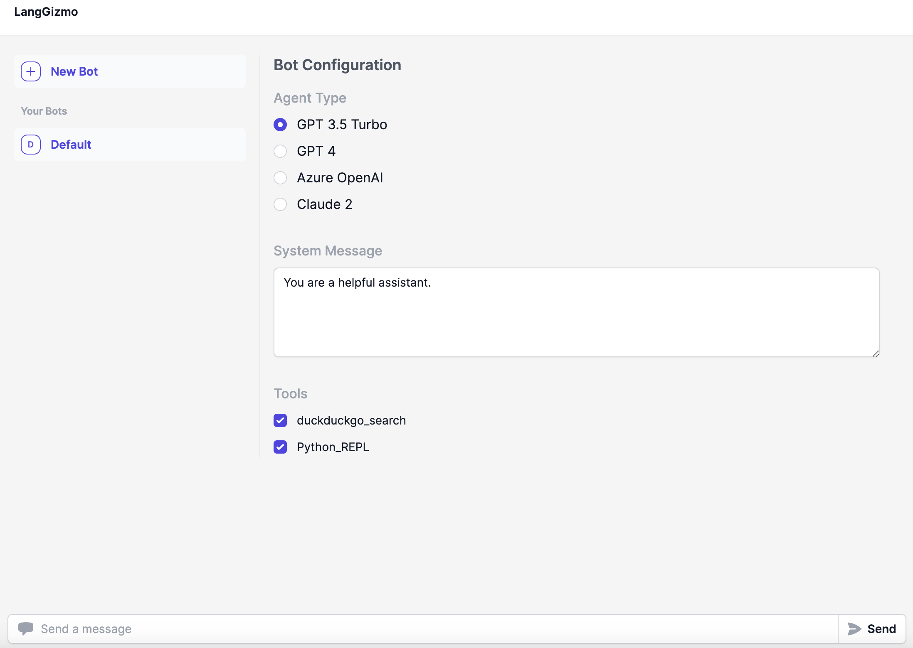
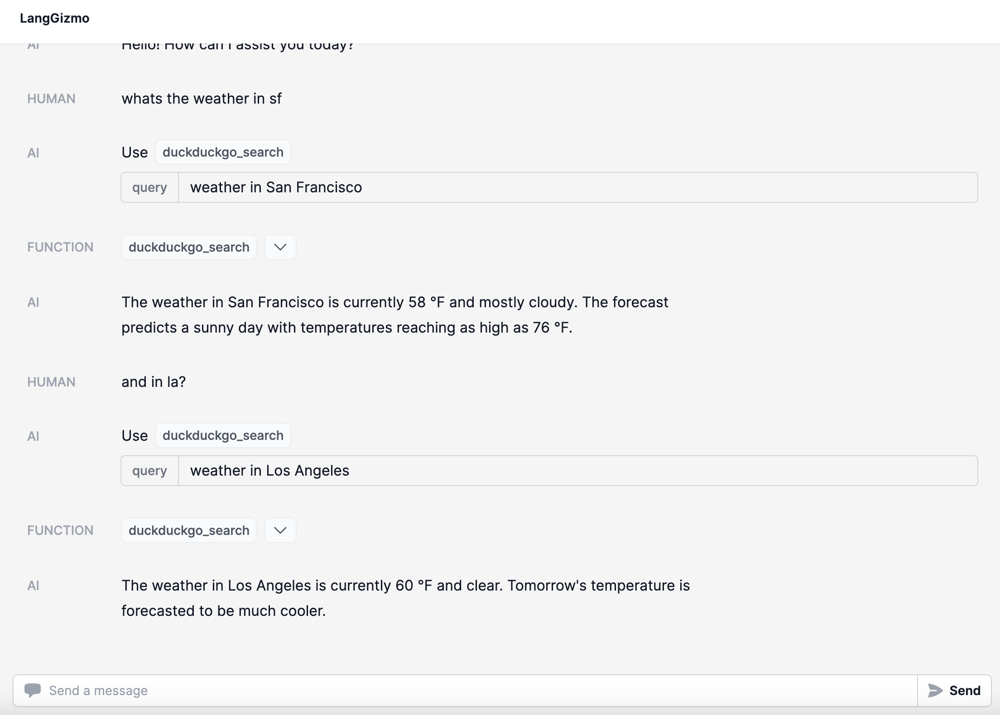

# OpenGPTs

This is an open source effort to create a similar experience as OpenAI's GPTs.
This builds upon [LangChain](https://github.com/langchain-ai/langchain), [LangServe](https://github.com/langchain-ai/langserve) and [LangSmith](https://smith.langchain.com/)
This gives you more control over the LLM you use (choose between the 60+ that LangChain offers),
the prompts you use (use LangSmith to debug those), and the tools you give it (choose from LangChain's 100+ tools, or easily write your own).

<p align="center">
    
    
</p>

Check out a simple hosted version [here](https://opengpts-example-vz4y4ooboq-uc.a.run.app/)

## Quickstart

**1. Start the backend**

Install requirements

```shell
cd backend
pip install -r requirements.txt
```

By default, this uses OpenAI, but there are also options for Azure OpenAI and Anthropic.
If you are using those, you may need to set different environment variables.

```shell
export OPENAI_API_KEY="sk-..."
```

Set up [LangSmith](https://smith.langchain.com/).
This is optional, but it will help with debugging, logging, monitoring.
Sign up at the link above and then set the relevant environment variables

```shell
export LANGCHAIN_TRACING_V2="true"
export LANGCHAIN_API_KEY=...
```

Start the backend server

```shell
langchain serve --port=8100
```

**2. Start the frontend**

```shell
cd frontend
yarn
yarn dev
```

Navigate to [http://localhost:5173/](http://localhost:5173/) and enjoy!

## Features

As much as possible, we are striving for feature parity with OpenAI.

- [x] Sandbox - Provides an environment to import, test, and modify existing chatbots.
  - The chatbots used are all in code, so are easily editable
- [x] Custom Actions - Define additional functionality for your chatbot using OpenAPI specifications
  - Supported by adding tools
- [ ] Knowledge Files - attach additional files that your chatbot can reference
  - Coming soon
- [x] Tools - Provides basic tools for web browsing, image creation, etc.
  - Basic DuckDuckGo and PythonREPL tools enabled by default
  - Image creation coming soon
- [x] Analytics - View and analyze chatbot usage data
  - Use LangSmith for this
- [x] Drafts - Save and share drafts of chatbots you're creating
  - Supports saving of configurations
- [x] Publishing - publicly distribute your completed chatbot
  - Can do by deploying via LangServe
- [x] Sharing - Set up and manage chatbot sharing
  - Can do by deploying via LangServe
- [ ] Marketplace - Search and deploy chatbots created by other users
  - Coming soon

## Repo Structure

- `frontend`: Code for the frontend
- `backend`: Code for the backend
  - `app`: LangServe code (for exposing APIs)
  - `packages`: Core logic
    - `agent-executor`: Runtime for the agent
    - `gizmo-agent`: Configuration for the agent

## Customization

The big appeal of OpenGPTs as compared to using OpenAI directly is that it is more customizable.
Specifically, you can choose which language models to use as well as more easily add custom tools.
You can also use the underlying APIs directly and build a custom UI yourself should you choose.

### LLMs

You can choose between different LLMs to use.
This takes advantage of LangChain's many integrations.
It is important to note that depending on which LLM you use, you may need to change how you are prompting it.

We have expose four agent types by default:

- "GPT 3.5 Turbo"
- "GPT 4"
- "Azure OpenAI"
- "Claude 2"

We will work to add more when we have confidence they can work well.

If you want to add your own LLM or agent configuration, or want to edit the existing ones, you can find them in `backend/packages/gizmo-agent/gizmo_agent/agent_types`

#### Claude 2

If using Claude 2, you will need to set the following environment variable:

```shell
export ANTHROPIC_API_KEY=sk-...
```

#### Azure OpenAI

If using Azure OpenAI, you will need to set the following environment variables:

```shell
export OPENAI_API_BASE=...
export OPENAI_API_VERSION=...
export OPENAI_API_KEY=...
export OPENAI_DEPLOYMENT_NAME=...
```

### Tools

One of the big benefits of having this be open source is that you can more easily add tools (directly in Python).
We have enabled two tools by default:

- DuckDuckGo Search
- Python REPL (NOTE: this executes Python code directly in your environment and may not be safe)

In practice, most teams we see define their own tools.
This is easy to do within LangChain.
See [this guide](https://python.langchain.com/docs/modules/agents/tools/custom_tools) for details on how to best do this.

## Deployment

**1. Build the frontend**

```shell
cd frontend
yarn
yarn build
```

**2. Deploy to Google Cloud Run**

You can deploy to GCP Cloud Run using the following command:

First create a `.env.gcp.yaml` file with the contents from `.env.gcp.yaml.example` and fill in the values. Then run:

```shell
gcloud run deploy opengpts --source . --port 8001 --env-vars-file .env.gcp.yaml --allow-unauthenticated --region us-central1 --min-instances 1
```
