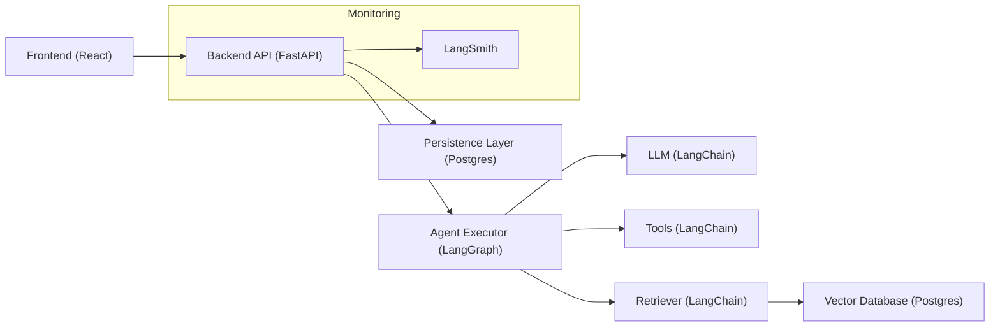
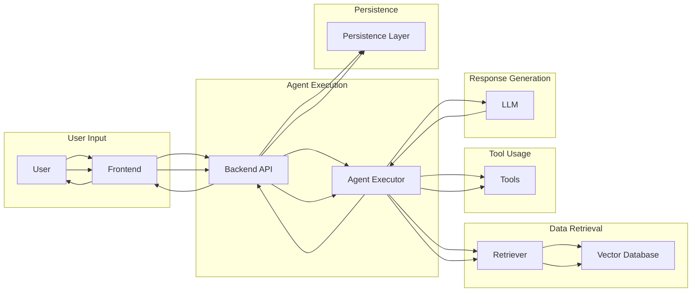
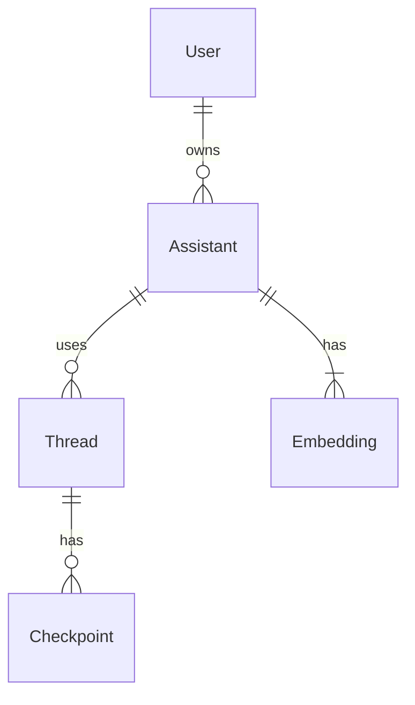
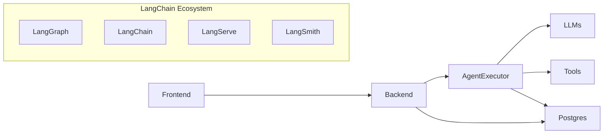

## OpenGPTs: Technical and Design Documentation

OpenGPTs is an open-source project aiming to replicate the functionality of OpenAI's GPTs and Assistants API, providing users with greater control and customization over their AI applications. This document provides a comprehensive overview of the project's architecture, components, and design decisions.

### 1. Initial Code Analysis

The OpenGPTs project is primarily written in Python for the backend and TypeScript for the frontend. It leverages several key technologies and frameworks:

- **LangGraph:** A framework for creating agent runtimes, powering the core logic of OpenGPTs.
- **LangChain:** A library for building applications with large language models (LLMs), providing integrations with various LLMs, tools, and vector databases.
- **LangServe:** A framework for deploying LangChain applications, used for exposing OpenGPTs APIs.
- **LangSmith:** A platform for debugging, logging, and monitoring LangChain applications, offering valuable insights into agent behavior.
- **FastAPI:** A modern, fast web framework for building APIs with Python, used for the backend API.
- **React:** A JavaScript library for building user interfaces, used for the frontend.
- **Vite:** A build tool and development server for frontend development, providing fast module reloading and optimized builds.
- **Tailwind CSS:** A utility-first CSS framework for styling the frontend.
- **Postgres:** A relational database used for storing agent configurations, chat history, and embeddings.
- **pgvector:** A Postgres extension for efficient vector similarity search, used for storing and querying embeddings.

### 2. Architectural Overview

#### 2.1 High-Level Architecture Diagram

#### 2.2 System Structure and Component Interactions

The OpenGPTs architecture consists of three main components:

- **Frontend:** The user interface built with React, allowing users to interact with the system, create and manage assistants, and engage in conversations.
- **Backend API:** The FastAPI application exposing RESTful APIs for managing assistants, threads, runs, and data ingestion.
- **Agent Executor:** The core logic of OpenGPTs, powered by LangGraph, responsible for executing agents based on their configurations and user inputs.

The frontend communicates with the backend API to perform actions like creating assistants, starting conversations, and sending messages. The backend API interacts with the Agent Executor to run the configured agent, which in turn utilizes LangChain integrations to access LLMs, tools, and the vector database. The backend API also handles data persistence, storing assistant configurations, chat history, and embeddings in Postgres. LangSmith is integrated for monitoring and debugging purposes.

#### 2.3 Architectural Decisions

- **LangGraph as the Agent Runtime:** LangGraph provides a flexible and modular framework for defining and executing complex agent workflows, allowing for easy customization and extension of agent behavior.
- **Postgres for Persistence:** Postgres offers a robust and reliable database solution for storing agent configurations, chat history, and embeddings. The pgvector extension enables efficient vector similarity search for retrieval-based agents.
- **LangChain for LLM and Tool Integrations:** LangChain provides a wide range of integrations with various LLMs, tools, and vector databases, simplifying the process of building and customizing agents.
- **LangServe for API Deployment:** LangServe streamlines the deployment of LangChain applications, making it easy to expose OpenGPTs APIs for external consumption.
- **LangSmith for Monitoring and Debugging:** LangSmith offers valuable insights into agent behavior, facilitating debugging, performance analysis, and optimization.

### 3. Detailed Component Analysis

#### 3.1 Frontend (React)

The frontend is responsible for providing a user-friendly interface for interacting with OpenGPTs. It allows users to:

- Create and manage assistants, defining their names, configurations, and tools.
- Start and manage conversations, sending messages and receiving responses from the agent.
- Upload and manage knowledge files for retrieval-based agents.
- View and analyze chatbot usage data through LangSmith integration.

The frontend is built with React, utilizing components, hooks, and state management to create a responsive and interactive user experience. It communicates with the backend API via HTTP requests to perform actions and retrieve data.

#### 3.2 Backend API (FastAPI)

The backend API exposes RESTful endpoints for managing assistants, threads, runs, and data ingestion. It handles:

- **Assistant Management:** Creating, retrieving, updating, and deleting assistants.
- **Thread Management:** Creating, retrieving, updating, and deleting threads.
- **Run Management:** Creating and streaming runs, retrieving input/output schemas, and sending feedback to LangSmith.
- **Data Ingestion:** Uploading and ingesting files into the vector database.

The backend API is built with FastAPI, leveraging its features for data validation, dependency injection, and automatic API documentation generation. It interacts with the Agent Executor to run agents, the Persistence Layer to store data, and LangSmith for monitoring.

#### 3.3 Agent Executor (LangGraph)

The Agent Executor is the core logic of OpenGPTs, responsible for executing agents based on their configurations and user inputs. It utilizes LangGraph to define and execute agent workflows, supporting different cognitive architectures:

- **Assistants:** Agents equipped with tools, using an LLM to decide when to use them.
- **RAGBot:** Retrieval-focused agents, retrieving relevant documents before generating responses.
- **ChatBot:** Simple agents parameterized by a system message, focusing on persona and character.

The Agent Executor utilizes LangChain integrations to access LLMs, tools, and the vector database. It also interacts with the Persistence Layer to manage checkpoints and retrieve chat history.

### 4. Data Flow and State Management

#### 4.1 Data Flow Diagram

#### 4.2 Data Flow Explanation

1. **User Input:** The user interacts with the frontend, providing input like messages or file uploads.
2. **Agent Execution:** The frontend sends the user input to the backend API, which triggers the Agent Executor to run the configured agent.
3. **Data Retrieval (if applicable):** For retrieval-based agents, the Agent Executor utilizes the Retriever to query the Vector Database for relevant documents.
4. **Tool Usage (if applicable):** For agents equipped with tools, the Agent Executor may utilize various tools based on the agent's logic.
5. **Response Generation:** The LLM processes the input and retrieved data (if any), generating a response.
6. **Response Delivery:** The Agent Executor sends the LLM's response back to the backend API, which forwards it to the frontend for display to the user.
7. **Persistence:** Throughout the process, the backend API interacts with the Persistence Layer to store and retrieve assistant configurations, chat history, embeddings, and checkpoints.

#### 4.3 State Management

OpenGPTs utilizes checkpoints to manage agent state, allowing for resuming conversations and tracking agent progress. The `PostgresCheckpoint` class handles saving and retrieving checkpoints from the Postgres database. Different `CheckpointAt` options determine when checkpoints are saved, such as at the end of each step or conversation turn.

### 5. API and Interface Documentation

The backend API exposes RESTful endpoints for interacting with OpenGPTs. Refer to the `API.md` file for detailed API documentation, including request/response formats and examples.

#### 5.1 Authentication and Authorization

OpenGPTs supports different authentication mechanisms, configurable via the `AUTH_TYPE` environment variable:

- **NOOP:** No authentication, suitable for development and testing.
- **JWT_LOCAL:** JWT authentication using a locally configured decode key.
- **JWT_OIDC:** JWT authentication using an OIDC provider for key discovery.

For production deployments, JWT authentication is recommended. Refer to the `auth.md` file for a guide on setting up JWT authentication for production.

### 6. Database and Data Model

#### 6.1 Entity-Relationship Diagram (ERD)

#### 6.2 Table Structures

- **User:** Stores user information, including a unique `user_id` and `sub` (from JWT).
- **Assistant:** Stores assistant configurations, including `assistant_id`, `user_id`, `name`, `config`, `updated_at`, and `public` flag.
- **Thread:** Stores conversation threads, including `thread_id`, `user_id`, `assistant_id`, `name`, `updated_at`, and `metadata`.
- **Checkpoint:** Stores agent checkpoints, including `thread_id`, `thread_ts`, `parent_ts`, and the serialized `checkpoint` data.
- **langchain_pg_embedding:** Stores embeddings for uploaded documents, including `document`, `collection_id`, `cmetadata`, `custom_id`, `embedding`, and `uuid`.

#### 6.3 Data Access Patterns and Optimization

- **Vector Similarity Search:** The `pgvector` extension enables efficient vector similarity search for retrieval-based agents, allowing for fast retrieval of relevant documents based on embedding similarity.
- **Indexes:** Appropriate indexes are used on key columns like `user_id`, `assistant_id`, and `thread_id` to optimize query performance.
- **Caching:** LRU caching is used for certain operations like retrieving signing keys from OIDC providers and parsing tools, reducing redundant computations and improving response times.

### 7. Algorithm and Data Structure Analysis

#### 7.1 Complex Algorithms

- **Agent Execution Workflow:** The core agent execution logic is implemented as a graph-based workflow using LangGraph. Different graph types like `MessageGraph` and `StateGraph` are used to model different agent architectures.
- **Retrieval:** Retrieval-based agents utilize vector similarity search to find relevant documents from the vector database.
- **Tool Selection:** Agents equipped with tools use LLMs to decide which tools to call and how to use them based on the conversation context.

#### 7.2 Time and Space Complexity

- **Agent Execution:** The time complexity of agent execution depends on the specific agent architecture and the complexity of the LLM and tools used.
- **Retrieval:** The time complexity of retrieval is determined by the efficiency of the vector similarity search implementation in `pgvector`.
- **Tool Usage:** The time complexity of tool usage depends on the specific tools used.

#### 7.3 Data Structure Choices

- **Graphs:** LangGraph utilizes graphs to represent agent workflows, providing a flexible and modular way to define complex agent behavior.
- **Dictionaries:** Dictionaries are used extensively for storing agent configurations, tool parameters, and message data.
- **Lists:** Lists are used for storing conversation history, tool calls, and retrieved documents.

### 8. Security Considerations

#### 8.1 Authentication and Authorization

OpenGPTs supports JWT authentication for securing API access. Refer to the `auth.md` file for a guide on setting up JWT authentication for production.

#### 8.2 Potential Security Vulnerabilities

- **Input Validation:** Insufficient input validation could lead to injection attacks or other security vulnerabilities.
- **Data Sanitization:** Improper data sanitization could expose sensitive information or allow for cross-site scripting attacks.
- **Access Control:** Weak access control mechanisms could allow unauthorized users to access or modify sensitive data.

#### 8.3 Security Best Practices and Improvements

- **Implement robust input validation and data sanitization techniques.**
- **Enforce strong access control mechanisms, using role-based access control (RBAC) if necessary.**
- **Regularly update dependencies and apply security patches.**
- **Conduct security audits and penetration testing to identify and address vulnerabilities.**

### 9. Performance and Scalability

#### 9.1 Potential Performance Bottlenecks

- **LLM Latency:** The latency of the LLM can significantly impact agent response times.
- **Vector Database Queries:** Inefficient vector similarity search or lack of proper indexing can slow down retrieval-based agents.
- **Tool Execution:** The execution time of tools can vary greatly, potentially impacting overall agent performance.

#### 9.2 Optimization Strategies

- **LLM Caching:** Cache LLM responses for frequently used prompts or conversation turns.
- **Vector Database Optimization:** Use appropriate indexing and tuning techniques to optimize vector similarity search performance.
- **Tool Parallelization:** Execute multiple tools in parallel when possible to reduce overall execution time.

#### 9.3 Scalability Considerations

- **Horizontal Scaling:** Deploy multiple instances of the backend API and Agent Executor to handle increased traffic.
- **Database Scaling:** Utilize database scaling techniques like sharding or replication to handle larger datasets and higher query loads.
- **LLM Scaling:** Consider using LLMs with higher throughput or parallel processing capabilities for improved scalability.

### 10. Testing and Quality Assurance

#### 10.1 Testing Strategy and Coverage

OpenGPTs utilizes unit tests and integration tests to ensure code quality and functionality. Unit tests focus on individual components and functions, while integration tests verify the interactions between different components.

#### 10.2 Running and Maintaining Tests

Tests can be run using the `pytest` framework. Refer to the `Makefile` for commands to run tests.

#### 10.3 Areas for Improved Testing

- **Expand test coverage to include more edge cases and scenarios.**
- **Implement end-to-end tests to verify the complete system functionality.**
- **Utilize automated testing tools and frameworks for continuous integration and delivery.**

### 11. Deployment and DevOps

#### 11.1 Deployment Instructions and Requirements

Refer to the `README.md` file for detailed deployment instructions, including requirements and steps for deploying OpenGPTs using Docker or Kubernetes.

#### 11.2 CI/CD Pipeline

A CI/CD pipeline can be implemented to automate the build, testing, and deployment process. This would involve using tools like GitHub Actions or Jenkins to trigger automated builds and deployments on code changes.

#### 11.3 Monitoring and Logging

OpenGPTs integrates with LangSmith for monitoring and debugging purposes. LangSmith provides insights into agent behavior, allowing for performance analysis, error tracking, and optimization. Additionally, structured logging is implemented using `structlog`, providing detailed logs for troubleshooting and analysis.

### 12. Maintenance and Troubleshooting

#### 12.1 Troubleshooting Guide

Refer to the `README.md` file for a basic troubleshooting guide, including common issues and potential solutions.

#### 12.2 Debugging Tips and Best Practices

- **Utilize LangSmith for tracing agent execution and identifying errors.**
- **Examine structured logs for detailed information about agent behavior and errors.**
- **Use debugging tools and techniques like breakpoints and print statements to inspect code execution.**

#### 12.3 Maintenance Strategy

- **Regularly update dependencies and apply security patches.**
- **Monitor system performance and address any bottlenecks.**
- **Refactor code as needed to improve maintainability and reduce technical debt.**
- **Document code changes and updates to maintain a clear understanding of the codebase.**

### 13. Reflection and Refinement

This documentation provides a comprehensive overview of the OpenGPTs project. However, continuous review and refinement are essential to ensure its accuracy, completeness, and relevance.

### 14. Future Considerations

#### 14.1 Potential Improvements

- **Expand tool and LLM integrations to offer a wider range of options for customization.**
- **Implement a marketplace for sharing and discovering pre-built agents.**
- **Develop advanced features like multi-modal agents and personalized agent training.**

#### 14.2 Architectural Evolution

The OpenGPTs architecture can evolve to incorporate new technologies and features, such as:

- **Serverless Deployment:** Utilize serverless platforms like AWS Lambda or Google Cloud Functions for improved scalability and cost-efficiency.
- **Federated Learning:** Implement federated learning techniques to allow for collaborative agent training without sharing sensitive data.

#### 14.3 Technical Debt

- **Code Refactoring:** Some parts of the codebase may benefit from refactoring to improve maintainability and readability.
- **Documentation Updates:** As the project evolves, documentation should be updated to reflect new features and changes.

### Architectural Decision Records (ADRs)

Separate Markdown files will be created for each major architectural decision, providing detailed explanations and justifications for the chosen approach.

### Technical Deep Dives

Separate Markdown files will be created for complex components or algorithms, offering in-depth technical explanations and analysis.

This documentation serves as a comprehensive guide for developers working on or maintaining the OpenGPTs project. It provides a detailed understanding of the system's architecture, components, and design decisions, facilitating development, maintenance, and future enhancements.
## OpenGPTs Software Architecture Document

**Version:** 1.0
**Date:** 2023-11-21

### Executive Summary

OpenGPTs is an open-source project aiming to replicate the functionality of OpenAI's GPTs and Assistants API, providing users with greater control and customization over their AI applications. The system leverages several LangChain libraries, including LangGraph, LangChain, LangServe, and LangSmith, to achieve this goal.

Key architectural decisions include:

* **Modular Design:** The system is decomposed into distinct modules for frontend, backend, agent execution, and configuration, promoting maintainability and extensibility.
* **Pluggable LLMs and Tools:** OpenGPTs supports a wide range of LLMs and tools through LangChain integrations, allowing users to tailor their AI agents to specific needs.
* **Cognitive Architecture Options:** The system offers three distinct cognitive architectures (Assistant, RAG, and Chatbot), each with its own strengths and use cases, providing flexibility for different applications.
* **Persistence with Postgres:** OpenGPTs utilizes Postgres for storing agent configurations, chat history, and embeddings, ensuring data persistence and enabling vector database capabilities.
* **JWT Authentication:** The system recommends JWT authentication for production deployments, enhancing security and enabling integration with identity providers.

### System Context and Scope

OpenGPTs aims to empower developers to build and deploy custom AI agents with the flexibility and control not readily available in closed-source solutions like OpenAI's GPT store. The system provides a platform for creating, testing, and deploying AI agents with configurable LLMs, tools, and cognitive architectures.

**System Boundaries:**

* **Frontend:** A React-based user interface for interacting with the system, creating and managing agents, and conducting conversations.
* **Backend:** A FastAPI-based server that exposes APIs for managing assistants, threads, runs, and file ingestion.
* **Agent Executor:** The core logic responsible for executing AI agents based on the chosen cognitive architecture and configured LLMs and tools.
* **Configuration:** Defines the structure and parameters of AI agents, including LLM selection, tool integration, and system message customization.

**External Dependencies:**

* **LangChain Libraries:** LangGraph, LangChain, LangServe, and LangSmith provide the foundation for agent execution, tool integration, API exposure, and monitoring.
* **LLM Providers:** OpenAI, Azure OpenAI, Anthropic, Google, and Ollama are supported for LLM access.
* **Tool Providers:** Various tool providers are integrated through LangChain, including DuckDuckGo Search, Tavily Search, You.com Search, Arxiv, PubMed, Wikipedia, and Connery.
* **Postgres:** Used for data persistence, including agent configurations, chat history, and embeddings.

### Architectural Representation

**Architectural Style:**

OpenGPTs follows a modular, service-oriented architecture. The frontend and backend communicate through APIs, allowing for independent development and deployment. The Agent Executor acts as a central service, orchestrating the interaction between LLMs, tools, and the Postgres database.

**Architectural Patterns:**

* **Dependency Injection:** LangChain's RunnableBinding pattern is used to inject different LLMs, tools, and cognitive architectures into the Agent Executor.
* **Chain of Responsibility:** The Agent Executor employs a chain of responsibility pattern to process user input, determine tool usage, and generate responses.
* **Repository Pattern:** The Postgres database is accessed through a repository layer, abstracting data access logic from the Agent Executor.

### System Decomposition

#### Frontend

**Responsibilities:**

* Provides a user-friendly interface for interacting with the system.
* Enables users to create, manage, and test AI agents.
* Facilitates conversations with AI agents.
* Uploads knowledge files for RAG agents.

**Key Functionalities:**

* **Agent Management:** Create, edit, delete, and publish AI agents.
* **Thread Management:** Create, rename, and delete conversation threads.
* **Conversation Interface:** Send messages to AI agents and receive responses.
* **File Upload:** Upload and manage knowledge files for RAG agents.

**Interactions:**

* Communicates with the backend through REST APIs to manage agents, threads, and runs.
* Receives real-time updates from the backend via Server-Sent Events (SSE) for streaming responses.

**Design Patterns and Principles:**

* **React Hooks:** Used for managing component state and side effects.
* **React Query:** Employed for fetching and caching data from the backend.
* **Tailwind CSS:** Provides a utility-first CSS framework for styling.

#### Backend

**Responsibilities:**

* Exposes REST APIs for frontend interaction.
* Handles file uploads and ingestion.
* Manages user authentication and authorization.
* Provides health check endpoints.

**Key Functionalities:**

* **API Endpoints:** Offers endpoints for managing assistants, threads, runs, and file ingestion.
* **File Upload Handling:** Receives uploaded files, determines mimetypes, and converts them to blobs.
* **Authentication:** Implements JWT authentication for secure access.
* **Health Checks:** Provides endpoints for monitoring system health.

**Interactions:**

* Receives requests from the frontend and routes them to appropriate handlers.
* Invokes the Agent Executor to run AI agents based on user requests.
* Communicates with the Postgres database to store and retrieve data.

**Design Patterns and Principles:**

* **FastAPI:** Provides a modern, asynchronous web framework.
* **Dependency Injection:** Used to inject dependencies like the database connection pool and authentication handler.
* **Router Pattern:** Organizes API endpoints into logical groups.

#### Agent Executor

**Responsibilities:**

* Executes AI agents based on the chosen cognitive architecture.
* Orchestrates the interaction between LLMs, tools, and the Postgres database.
* Manages agent state and checkpoints.

**Key Functionalities:**

* **Agent Execution:** Runs AI agents based on user input and configured parameters.
* **Tool Selection and Execution:** Determines tool usage based on agent logic and executes selected tools.
* **Retrieval:** Retrieves relevant information from the Postgres vector database for RAG agents.
* **Response Generation:** Generates responses using the configured LLM.
* **State Management:** Maintains agent state and persists it using checkpoints.

**Interactions:**

* Receives instructions from the backend to execute AI agents.
* Communicates with LLM providers to generate responses.
* Executes tools based on agent logic.
* Interacts with the Postgres database to retrieve relevant information and store checkpoints.

**Design Patterns and Principles:**

* **LangGraph:** Provides a framework for defining and executing AI agent workflows.
* **Chain of Responsibility:** Used to process user input, determine tool usage, and generate responses.
* **State Pattern:** Manages agent state and transitions between different states.
* **Memento Pattern:** Persists agent state using checkpoints.

#### Configuration

**Responsibilities:**

* Defines the structure and parameters of AI agents.
* Provides configuration options for LLMs, tools, and system messages.

**Key Functionalities:**

* **Agent Type Selection:** Allows users to choose between different cognitive architectures (Assistant, RAG, and Chatbot).
* **LLM Configuration:** Enables selection of LLM provider and model.
* **Tool Integration:** Configures and integrates tools from various providers.
* **System Message Customization:** Allows users to define the initial instructions for the AI agent.

**Interactions:**

* Configuration parameters are stored in the Postgres database.
* The Agent Executor reads configuration parameters to instantiate and execute AI agents.

**Design Patterns and Principles:**

* **Configurable Fields:** LangChain's ConfigurableField pattern is used to define configurable parameters for AI agents.
* **Factory Pattern:** Used to create instances of different LLMs, tools, and cognitive architectures based on configuration parameters.

### Data Architecture

**Data Model:**

* **User:** Represents a user of the system, identified by a unique user ID and a sub from a JWT token.
* **Assistant:** Represents an AI agent, with a unique assistant ID, user ID, name, configuration, update timestamp, and public visibility flag.
* **Thread:** Represents a conversation thread, with a unique thread ID, user ID, assistant ID, name, update timestamp, and metadata.
* **Checkpoint:** Stores the state of an AI agent at a specific point in time, associated with a thread ID and timestamp.
* **Embedding:** Stores document embeddings and metadata in the Postgres vector database, associated with a namespace (assistant ID or thread ID).

**Database Schema:**

* **user:** (user_id UUID PRIMARY KEY, sub VARCHAR(255) UNIQUE, created_at TIMESTAMP WITH TIME ZONE)
* **assistant:** (assistant_id UUID PRIMARY KEY, user_id UUID, name VARCHAR(255), config JSON, updated_at TIMESTAMP WITH TIME ZONE, public BOOLEAN)
* **thread:** (thread_id UUID PRIMARY KEY, assistant_id UUID, user_id UUID, name VARCHAR(255), updated_at TIMESTAMP WITH TIME ZONE, metadata JSONB)
* **checkpoints:** (thread_id TEXT, thread_ts TIMESTAMPTZ, parent_ts TIMESTAMPTZ, checkpoint BYTEA, PRIMARY KEY (thread_id, thread_ts))
* **langchain_pg_embedding:** (document TEXT, collection_id UUID, cmetadata JSON, custom_id TEXT, embedding VECTOR(1536), uuid UUID PRIMARY KEY)

**Data Flow:**

* **Frontend:** Sends user input and agent management requests to the backend.
* **Backend:** Stores and retrieves assistant and thread data in the Postgres database.
* **Agent Executor:** Reads agent configuration from the database, retrieves relevant information from the vector database, and persists agent state using checkpoints.
* **LLM Providers:** Receive prompts from the Agent Executor and return generated responses.
* **Tool Providers:** Receive instructions from the Agent Executor and return tool execution results.

**Data Storage and Caching:**

* **Postgres:** Serves as the primary data store for agent configurations, chat history, and embeddings.
* **LangChain:** Provides in-memory caching for LLM and tool responses.
* **React Query:** Caches data fetched from the backend in the frontend.

**Data Consistency:**

* **Postgres Transactions:** Ensure atomicity and consistency for database operations.
* **Checkpoints:** Provide a mechanism for restoring agent state to a consistent point in time.

### Interface Specifications

**Internal APIs:**

* **Agent Executor:** Exposes methods for getting state, updating state, and streaming events.
* **Storage:** Provides functions for managing assistants, threads, checkpoints, and users in the Postgres database.

**External APIs:**

* **Backend:** Exposes REST APIs for frontend interaction, including endpoints for managing assistants, threads, runs, and file ingestion.
* **LLM Providers:** Offer APIs for sending prompts and receiving generated responses.
* **Tool Providers:** Provide APIs for executing tools and retrieving results.

**Communication Protocols:**

* **Frontend-Backend:** REST APIs over HTTP.
* **Backend-Agent Executor:** Asynchronous function calls.
* **Agent Executor-LLM/Tool Providers:** API calls over HTTP or other provider-specific protocols.

**Data Formats:**

* **JSON:** Used for data exchange between the frontend, backend, and Agent Executor.
* **LangChain Message Schema:** Used for representing messages within the Agent Executor.
* **Provider-Specific Formats:** LLM and tool providers may use their own data formats for input and output.

### Quality Attributes

#### Scalability

* **Modular Design:** The system's modular architecture allows for independent scaling of individual components.
* **Postgres:** Offers horizontal scalability through replication and sharding.
* **LangServe:** Enables deployment to scalable cloud platforms like Google Cloud Run.

#### Performance

* **Asynchronous Processing:** The backend and Agent Executor utilize asynchronous programming for efficient handling of concurrent requests.
* **Caching:** LangChain and React Query provide caching mechanisms to reduce latency.
* **Streaming Responses:** Server-Sent Events (SSE) enable real-time streaming of responses, improving perceived performance.

#### Security

* **JWT Authentication:** Recommended for production deployments, providing secure access control.
* **Input Validation:** Pydantic models are used to validate API requests, preventing malicious input.

#### Reliability

* **Postgres:** Offers data durability and replication for fault tolerance.
* **Checkpoints:** Enable recovery from failures by restoring agent state to a consistent point in time.
* **Error Handling:** The system implements error handling mechanisms to gracefully handle exceptions.

#### Maintainability

* **Modular Design:** The system's modular architecture promotes code reusability and separation of concerns.
* **Clear Interface Specifications:** Well-defined APIs facilitate understanding and integration between components.
* **Open-Source Libraries:** Leveraging LangChain libraries provides access to a well-maintained and evolving ecosystem.

### Cross-Cutting Concerns

#### Logging and Monitoring

* **LangSmith:** Provides tracing, logging, and monitoring capabilities for AI agent executions.
* **Structlog:** Used for structured logging in the backend.

#### Error Handling and Fault Tolerance

* **Exception Handling:** The system implements exception handling mechanisms to catch and log errors.
* **Retries:** LangChain provides retry mechanisms for handling transient errors when interacting with LLM and tool providers.
* **Postgres Replication:** Ensures data availability in case of database failures.

#### Configuration Management

* **Environment Variables:** Used to configure system parameters, including database connection details, LLM provider keys, and authentication settings.
* **Pydantic Settings:** Provides a structured way to manage configuration settings.

#### Authentication and Authorization

* **JWT Authentication:** Recommended for production deployments, enabling secure access control and integration with identity providers.
* **Role-Based Access Control:** Not currently implemented, but could be added in the future to manage user permissions.

### Architectural Decisions

#### Decision: Modular Design

* **Context:** The system aims to provide flexibility and extensibility for building and deploying AI agents.
* **Alternatives Considered:** Monolithic architecture.
* **Reasoning:** A modular design promotes separation of concerns, code reusability, and independent development and deployment of components.
* **Implications:** Increased complexity in managing inter-module communication, but improved maintainability and scalability.

#### Decision: Pluggable LLMs and Tools

* **Context:** The system aims to support a wide range of LLMs and tools to cater to diverse user needs.
* **Alternatives Considered:** Hardcoding specific LLM and tool integrations.
* **Reasoning:** Leveraging LangChain integrations provides a flexible and extensible way to support various providers.
* **Implications:** Dependence on the LangChain ecosystem, but increased flexibility and reduced development effort.

#### Decision: Cognitive Architecture Options

* **Context:** The system aims to cater to different use cases and agent complexities.
* **Alternatives Considered:** Offering a single, fixed cognitive architecture.
* **Reasoning:** Providing multiple architecture options allows users to choose the best fit for their specific needs.
* **Implications:** Increased complexity in managing different architectures, but greater flexibility for users.

#### Decision: Persistence with Postgres

* **Context:** The system requires data persistence for agent configurations, chat history, and embeddings.
* **Alternatives Considered:** Using Redis or other NoSQL databases.
* **Reasoning:** Postgres offers data durability, transactional integrity, and built-in support for vector embeddings.
* **Implications:** Potential performance limitations compared to in-memory databases, but improved data consistency and reliability.

#### Decision: JWT Authentication

* **Context:** The system requires secure access control for production deployments.
* **Alternatives Considered:** Cookie-based authentication, API keys.
* **Reasoning:** JWT authentication provides a standard, secure mechanism for user authentication and integration with identity providers.
* **Implications:** Increased complexity in managing JWT tokens, but enhanced security and flexibility.

### Deployment View

OpenGPTs can be deployed to various environments, including local development setups, cloud platforms, and Kubernetes clusters.

**Scaling Strategies:**

* **Horizontal Scaling:** The backend and Agent Executor can be scaled horizontally by deploying multiple instances behind a load balancer.
* **Postgres Replication:** Enables horizontal scaling of the database through read replicas.
* **Cloud Run:** Provides automatic scaling based on request load.

**Infrastructure Requirements:**

* **Compute:** Virtual machines or containers for running the frontend, backend, and Agent Executor.
* **Storage:** Postgres database for data persistence.
* **Networking:** Load balancer for distributing traffic to backend instances.

### Development and DevOps Considerations

#### Development Environment Setup

* **Docker Compose:** Provides a convenient way to set up a local development environment with all necessary services.
* **Poetry:** Used for managing backend dependencies.
* **NPM:** Manages frontend dependencies.

#### CI/CD Pipeline and Deployment Processes

* **GitHub Actions:** Can be used to automate the CI/CD pipeline, including code linting, testing, and deployment.
* **Cloud Run:** Provides a streamlined deployment process for the backend.
* **Helm Charts:** Can be used to deploy the backend to Kubernetes clusters.

### Future Considerations and Recommendations

#### Potential Improvements

* **Role-Based Access Control:** Implement RBAC to manage user permissions and access to resources.
* **Marketplace:** Develop a marketplace for users to share and discover AI agents.
* **Enhanced Monitoring:** Integrate with more comprehensive monitoring tools for real-time performance and error tracking.
* **Improved Tool Integration:** Expand the range of supported tools and provide a more streamlined process for adding custom tools.

#### Architectural Evolution

* **Microservices:** Decompose the backend into smaller, independent microservices for improved scalability and fault isolation.
* **Serverless Architecture:** Explore using serverless technologies like AWS Lambda or Google Cloud Functions for running the Agent Executor.
* **Federated Learning:** Investigate incorporating federated learning techniques to enable collaborative training of AI agents across multiple datasets.

### Appendices

* **Detailed Architecture Diagrams:** Include more detailed diagrams for specific components or workflows.
* **Code Snippets:** Provide code examples for key functionalities or design patterns.
* **Performance Benchmarking Results:** Document performance benchmarks for different deployment configurations and workloads.

### Conclusion

OpenGPTs provides a powerful and flexible platform for building and deploying custom AI agents. Its modular architecture, pluggable components, and support for various cognitive architectures empower developers to create tailored solutions for diverse use cases. The system's reliance on open-source libraries and its commitment to extensibility ensure its continued evolution and relevance in the rapidly advancing field of AI.
