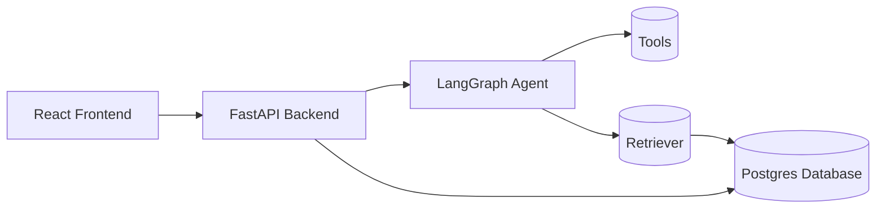
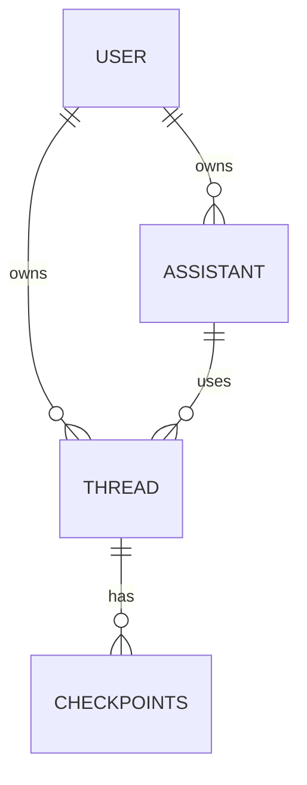

# OpenGPTs Documentation

## Project Overview

OpenGPTs is an open-source project aimed at replicating the functionality of OpenAI's GPTs and Assistants API. It leverages the LangGraph framework for creating agent runtimes and builds upon other LangChain components like LangChain, LangServe, and LangSmith.

### Purpose

The project provides developers with greater control and customization options compared to using OpenAI's services directly. It allows users to:

- Choose from a wide range of LLMs, tools, and vector databases supported by LangChain.
- Configure prompts and debug them using LangSmith.
- Define custom actions using OpenAPI specifications.
- Control the cognitive architecture of their applications.

### Features

- **Sandbox:** Import, test, and modify existing chatbots.
- **Custom Actions:** Define additional functionality using OpenAPI specifications and tools.
- **Knowledge Files:** Upload files for the chatbot to reference, used by the Retrieval tool.
- **Tools:** Basic tools for web browsing, image creation, etc. (DuckDuckGo and PythonREPL enabled by default).
- **Analytics:** View and analyze chatbot usage data via LangSmith.
- **Drafts:** Save and share drafts of chatbots.
- **Publishing:** Publicly distribute completed chatbots via LangServe.
- **Sharing:** Manage chatbot sharing via LangServe.
- **Marketplace:** (Coming soon) Search and deploy chatbots created by other users.

### Technologies and Frameworks Used

- **LangGraph:** Framework for creating agent runtimes.
- **LangChain:** Framework for building LLM-powered applications.
- **LangServe:** Framework for deploying and serving LLM-powered applications.
- **LangSmith:** Platform for debugging, logging, and monitoring LLM applications.
- **React:** JavaScript library for building user interfaces.
- **TypeScript:** Typed superset of JavaScript.
- **Vite:** Frontend build tool.
- **Tailwind CSS:** Utility-first CSS framework.
- **Postgres:** Relational database for storing agent configurations and chat history.
- **pgvector:** Postgres extension for vector similarity search.

## System Architecture

OpenGPTs follows a client-server architecture, with a React frontend communicating with a FastAPI backend. The backend handles agent execution, data persistence, and API endpoints.

### High-Level Architecture Diagram



### Main Components and Their Interactions

- **React Frontend:** Provides the user interface for interacting with chatbots, configuring assistants, and managing knowledge files.
- **FastAPI Backend:** Exposes API endpoints for managing assistants, threads, runs, and file ingestion. It also handles authentication and authorization.
- **LangGraph Agent:** Executes the chatbot logic based on the chosen cognitive architecture.
- **Tools:** Provide additional functionality to the agent, such as web search, image generation, and code execution.
- **Retriever:** Retrieves relevant information from the vector database based on user queries.
- **Postgres Database:** Stores assistant configurations, chat history, and embeddings of knowledge files.

### Design Patterns and Architectural Decisions

- **API-First Design:** The backend exposes a well-defined API, allowing for easy integration with different frontends or third-party applications.
- **Runnable-Based Architecture:** The agent logic is implemented using LangChain Runnables, providing a modular and extensible structure.
- **Cognitive Architecture Options:** The project offers different cognitive architectures (Assistant, RAG, Chatbot) to cater to various use cases.
- **Vector Database for Knowledge Retrieval:** Embeddings of knowledge files are stored in a vector database, enabling efficient similarity search for relevant information.

## Code Structure

### Directory Structure

```
├── backend
│   ├── app
│   │   ├── __init__.py
│   │   ├── agent_types
│   │   │   ├── __init__.py
│   │   │   ├── prompts.py
│   │   │   ├── tools_agent.py
│   │   │   └── xml_agent.py
│   │   ├── chatbot.py
│   │   ├── checkpoint.py
│   │   ├── ingest.py
│   │   ├── llms.py
│   │   ├── parsing.py
│   │   ├── retrieval.py
│   │   ├── schema.py
│   │   ├── server.py
│   │   ├── storage.py
│   │   └── stream.py
│   ├── tests
│   │   ├── integration_tests
│   │   │   └── test_app.py
│   │   ├── unit_tests
│   │   │   ├── __init__.py
│   │   │   ├── app
│   │   │   │   ├── __init__.py
│   │   │   │   ├── helpers.py
│   │   │   │   └── test_app.py
│   │   │   ├── fixtures
│   │   │   │   └── __init__.py
│   │   │   └── utils.py
│   │   └── __init__.py
│   ├── tools
│   │   └── redis_to_postgres
│   │       └── README.md
│   ├── packages
│   │   └── gizmo-agent
│   │       └── gizmo_agent
│   │           └── tools.py
│   └── upload.py
└── frontend
    └── src
        └── utils
            └── formTypes.ts

```

### Key Modules and Their Responsibilities

- **backend/app/server.py:** Main entry point for the FastAPI backend. Defines API routes and handles file ingestion.
- **backend/app/agent.py:** Defines the core agent logic and different cognitive architectures.
- **backend/app/llms.py:** Provides functions for instantiating different LLMs from OpenAI, Anthropic, Google, and Ollama.
- **backend/app/tools.py:** Defines the available tools and their configurations.
- **backend/app/retrieval.py:** Implements the retrieval logic using a vector database.
- **backend/app/storage.py:** Handles data persistence using Postgres.
- **backend/app/stream.py:** Implements the streaming logic for agent responses.
- **backend/upload.py:** Defines the runnable for ingesting files into the vector database.
- **frontend/src/components:** Contains React components for the user interface.
- **frontend/src/hooks:** Contains custom React hooks for managing state and data fetching.
- **frontend/src/utils:** Contains utility functions for schema simplification, default value generation, and string manipulation.

## API Documentation

The FastAPI backend exposes API endpoints for managing assistants, threads, and runs.

### Assistants API

- **GET /assistants/:** List all assistants for the current user.
- **GET /assistants/public/:** List all public assistants.
- **GET /assistants/{aid}:** Get an assistant by ID.
- **POST /assistants/:** Create an assistant.
- **PUT /assistants/{aid}:** Create or update an assistant.
- **DELETE /assistants/{aid}:** Delete an assistant by ID.

### Threads API

- **GET /threads/:** List all threads for the current user.
- **GET /threads/{tid}/state:** Get the current state of a thread.
- **POST /threads/{tid}/state:** Add state to a thread.
- **GET /threads/{tid}/history:** Get the history of a thread.
- **GET /threads/{tid}:** Get a thread by ID.
- **POST /threads/:** Create a thread.
- **PUT /threads/{tid}:** Update a thread.
- **DELETE /threads/{tid}:** Delete a thread by ID.

### Runs API

- **POST /runs/:** Create a run.
- **POST /runs/stream:** Create a run and stream the responses.
- **GET /runs/input_schema:** Return the input schema of the agent.
- **GET /runs/output_schema:** Return the output schema of the agent.
- **GET /runs/config_schema:** Return the config schema of the agent.
- **POST /runs/feedback:** Send feedback on a run to LangSmith.

### File Ingestion API

- **POST /ingest:** Upload files to the given assistant or thread.

### Authentication Methods

OpenGPTs supports different authentication methods, configurable via the `AUTH_TYPE` environment variable.

- **NOOP:** No authentication (for development and testing).
- **JWT Local:** JWT authentication using a hardcoded decode key from the `JWT_DECODE_KEY_B64` environment variable.
- **JWT OIDC:** JWT authentication using an OIDC provider. Requires setting the `JWT_ISS` and `JWT_AUD` environment variables.

## Database Schema

OpenGPTs uses Postgres with the pgvector extension for data persistence.

### Entity-Relationship Diagram (ERD)



### Table Descriptions

- **user:** Stores user information, including user ID and subject (from JWT).
- **assistant:** Stores assistant configurations, including name, config, and public visibility.
- **thread:** Stores thread information, including name, associated assistant, and metadata.
- **checkpoints:** Stores agent state checkpoints for each thread, including the checkpoint data, timestamp, and parent timestamp.

### Indexing and Optimization Strategies

- **pgvector:** The `pgvector` extension is used to store and query embeddings of knowledge files, enabling efficient similarity search.
- **Primary Keys and Foreign Keys:** Tables have appropriate primary keys and foreign keys to ensure data integrity and efficient querying.

## Algorithms and Data Structures

### Complex Algorithms

- **Tarjan's Algorithm:** Used for finding strongly connected components in the agent graph, which helps in detecting circular dependencies.
- **Dijkstra's Algorithm:** Used for finding the shortest path between nodes in the agent graph, which can be helpful for optimizing agent execution.
- **Prim's Algorithm:** Used for finding the minimum spanning tree of the agent graph, which can be useful for understanding the relationships between different agent components.

### Time and Space Complexity Analysis

- **Tarjan's Algorithm:** O(V + E), where V is the number of nodes and E is the number of edges in the graph.
- **Dijkstra's Algorithm:** O(E + V log V) using a priority queue.
- **Prim's Algorithm:** O(E log V) using a priority queue.

### Data Structure Choices

- **Graph:** The agent logic is represented as a graph, which allows for a flexible and modular structure.
- **Dictionary:** Used for storing agent configurations, thread states, and other data.
- **List:** Used for storing chat history, tool calls, and other sequential data.

## Deployment and Configuration

### Environment Setup Instructions

- Install Docker and docker-compose.
- Clone the OpenGPTs repository.
- Create a `.env` file based on `.env.example` and set the required environment variables, including API keys for LLMs and other services.

### Deployment Process

- Run `docker compose up` to build and start the frontend and backend services, including Postgres.

### Configuration Options

- **AUTH_TYPE:** Specifies the authentication method (NOOP, JWT Local, JWT OIDC).
- **API Keys:** Set API keys for LLMs and other services used by the tools.
- **Postgres Connection Parameters:** Configure connection parameters for the Postgres database.

## Testing Strategy

### Testing Approach

- **Unit Tests:** Test individual modules and functions in isolation.
- **Integration Tests:** Test the interaction between different components, including the frontend, backend, and agent.
- **End-to-End (E2E) Tests:** Test the entire application flow from the user's perspective.

### Test Coverage

- Aim for high test coverage across all critical modules and functionalities.

### Instructions for Running Tests

- Run `pytest` in the `backend` directory to execute unit and integration tests.

## Performance Considerations

### Identified Bottlenecks

- LLM inference time can be a significant bottleneck.
- Vector database queries can also impact performance, especially with large knowledge bases.

### Optimization Techniques

- **Caching:** Cache LLM responses and vector database results to reduce inference time and query latency.
- **Asynchronous Execution:** Use asynchronous programming to parallelize tasks and improve throughput.
- **Database Optimization:** Use appropriate indexing and query optimization techniques for the Postgres database.

### Scalability Considerations

- **Horizontal Scaling:** Deploy multiple instances of the backend and agent services to handle increased traffic.
- **Database Sharding:** Shard the Postgres database to distribute the load and improve scalability.

## Security Considerations

### Authentication and Authorization Mechanisms

- **JWT Authentication:** Securely authenticate users using JWT tokens.
- **Role-Based Access Control (RBAC):** (Coming soon) Implement RBAC to restrict access to certain resources based on user roles.

### Data Encryption and Protection Measures

- **HTTPS:** Use HTTPS to encrypt communication between the frontend and backend.
- **Database Encryption:** Encrypt sensitive data stored in the Postgres database.

### Potential Vulnerabilities and Mitigation Strategies

- **Input Validation:** Validate user inputs to prevent injection attacks.
- **Rate Limiting:** Implement rate limiting to prevent denial-of-service attacks.
- **Security Audits:** Conduct regular security audits to identify and address potential vulnerabilities.

## Troubleshooting and FAQs

### Common Issues and Their Solutions

- **API Key Errors:** Ensure that API keys for LLMs and other services are correctly set in the `.env` file.
- **Database Connection Errors:** Verify Postgres connection parameters in the `.env` file and ensure that the database is running.
- **Agent Execution Errors:** Use LangSmith to debug agent execution and identify potential issues in the agent logic.

### Debugging Tips

- Enable LangChain tracing to log agent execution details.
- Use a debugger to step through the code and inspect variables.

### Performance Tuning Recommendations

- Cache LLM responses and vector database results.
- Use asynchronous programming to parallelize tasks.
- Optimize database queries and indexing.

## Potential Issues and Areas for Improvement

- **Error Handling:** Implement more robust error handling and logging throughout the application.
- **Security Hardening:** Implement additional security measures, such as RBAC and input sanitization.
- **Documentation:** Expand the documentation to cover more advanced use cases and customization options.
- **Testing:** Increase test coverage, especially for edge cases and error handling.
- **User Interface:** Improve the user interface to provide a more intuitive and user-friendly experience.
- **Marketplace:** Implement the marketplace feature to allow users to share and discover chatbots.

## Conclusion

OpenGPTs is a promising open-source project that provides a flexible and customizable platform for building LLM-powered applications. By leveraging the power of LangChain and other related frameworks, it empowers developers to create innovative and powerful chatbot experiences. Addressing the identified potential issues and areas for improvement will further enhance the project's capabilities and make it a more robust and secure solution for building and deploying LLM-powered applications.
