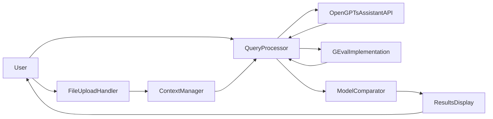

## OpenGPTs Model Comparison Module Architecture Document

**Version:** 1.0
**Date:** 2023-11-21

### 1. System Overview

This document outlines the architecture for a Model Comparison Module extending OpenGPTs, enabling users to evaluate the performance of different Large Language Models (LLMs) using the OpenGPTs Assistant API and the G-Eval metric.

**High-Level Description:**

The Model Comparison Module is designed as a Python script that integrates with the OpenGPTs Assistant API. It allows users to upload a file containing contextual information and then pose questions to the API, which will be answered by multiple LLMs. The module then evaluates the responses from each LLM using G-Eval, providing a quantitative comparison of their performance.

**Key Objectives:**

* **Facilitate LLM Comparison:** Provide a user-friendly way to compare the performance of different LLMs on a specific task.
* **Objective Evaluation:** Utilize G-Eval, a robust and comprehensive metric, for objective and automated evaluation.
* **Integration with OpenGPTs:** Seamlessly integrate with the OpenGPTs Assistant API for query processing.
* **Extensibility:** Allow easy addition of new LLMs and potentially other evaluation metrics in the future.

**Constraints:**

* **Python Implementation:** The module will be implemented as a Python script for simplicity and ease of integration with existing libraries.
* **G-Eval Focus:** The initial version will focus on G-Eval as the primary evaluation metric.

**G-Eval Integration:**

G-Eval is a core component of the architecture. It is used to evaluate the quality of LLM responses based on coherence, relevance, and factuality. The module implements G-Eval using the `deepeval` library, which provides a convenient interface for calculating G-Eval scores.

### 2. Component Architecture

The Model Comparison Module consists of the following major components:

* **File Upload Handler:** Responsible for handling user-uploaded files containing contextual information.
* **Context Manager:** Stores and manages the uploaded context, making it accessible for query processing and evaluation.
* **Query Processor:** Interfaces with the OpenGPTs Assistant API, sending user queries and receiving responses from multiple LLMs.
* **G-Eval Implementation:** Implements the G-Eval metric using the `deepeval` library, evaluating LLM responses based on predefined criteria.
* **Model Comparator:** Compares the G-Eval scores of different LLMs, providing a ranked list of models based on their performance.
* **Results Display:** Presents the evaluation results to the user, including G-Eval scores, reasoning, and model rankings.

**Interactions Between Components:**

1. The user uploads a file through the File Upload Handler.
2. The File Upload Handler passes the file content to the Context Manager for storage.
3. The user submits a query through the Query Processor.
4. The Query Processor retrieves the relevant context from the Context Manager.
5. The Query Processor sends the query and context to the OpenGPTs Assistant API, specifying the LLMs to be used.
6. The Query Processor receives responses from each LLM.
7. For each LLM response, the Query Processor invokes the G-Eval Implementation, which calculates a G-Eval score and provides reasoning.
8. The Query Processor passes the G-Eval scores and reasoning to the Model Comparator.
9. The Model Comparator ranks the LLMs based on their G-Eval scores.
10. The Results Display presents the evaluation results to the user.

**Data Flow Diagram:**



### 3. G-Eval Implementation

G-Eval will be implemented using the `deepeval` library. The evaluation process involves two steps:

**1. Generating Evaluation Steps:**

* A `LLMTestCase` object is created for each LLM response, containing the input context and the actual output generated by the model.
* A `GEval` metric object is initialized with specific criteria for evaluating coherence.
* The `measure` method of the `GEval` object is called with the `LLMTestCase` object, generating evaluation steps based on the defined criteria.

**2. Determining the Final Score:**

* The `score` attribute of the `GEval` object provides the final G-Eval score on a 1-5 scale, reflecting the coherence of the LLM response.
* The `reason` attribute provides a textual explanation of the score, highlighting specific aspects of the response that contributed to the evaluation.

**Optional Output Token Probabilities:**

G-Eval can optionally utilize output token probabilities to provide a more nuanced evaluation. This feature can be incorporated by providing the token probabilities from the LLM response to the `deepeval` library.

### 4. API Integration

**OpenGPTs Assistant API Interaction:**

The Query Processor interacts with the OpenGPTs Assistant API using the provided client library. It sends user queries along with the relevant context to the API, specifying the desired LLMs for evaluation. The API returns responses from each LLM, which are then processed by the module.

**Handling of Multiple LLM Models:**

The Query Processor can handle multiple LLM models by sending the same query and context to the Assistant API with different model specifications. The API will return separate responses for each model, allowing the module to evaluate and compare them.

### 5. Data Management

**Storage and Retrieval of Uploaded Files:**

* **Option 1: In-Memory Storage:** For simplicity, the initial version can store uploaded files in memory using Python data structures. This approach is suitable for small files and limited usage.
* **Option 2: File System Storage:** For larger files or persistent storage, the module can store files on the file system. This approach requires managing file paths and ensuring data integrity.
* **Option 3: Cloud Storage:** For scalability and reliability, cloud storage services like AWS S3 or Google Cloud Storage can be used. This approach requires integrating with the chosen cloud provider's API.

**Context Handling:**

The Context Manager is responsible for:

* Storing the uploaded context, either in memory, on the file system, or in cloud storage.
* Retrieving the relevant context for each user query based on the query's scope or specified context identifiers.
* Managing context updates or replacements as needed.

**Evaluation Metrics Storage and Analysis:**

* **Option 1: In-Memory Storage:** G-Eval scores and reasoning can be stored in memory during the evaluation process.
* **Option 2: CSV or JSON Files:** For persistent storage, evaluation metrics can be written to CSV or JSON files.
* **Option 3: Database Storage:** For more structured storage and analysis, a database like SQLite or Postgres can be used.

### 6. User Interface Considerations

**Key UI Components:**

* **File Upload:** A component for users to upload files containing contextual information.
* **Query Input:** A text box for users to enter their queries.
* **Model Selection:** A dropdown or list for users to choose the LLMs to be compared.
* **Results Display:** A table or chart to present the G-Eval scores, reasoning, and model rankings.

**User Experience Flow:**

1. The user uploads a file containing context.
2. The user selects the LLMs to be compared.
3. The user enters a query.
4. The system processes the query and displays the evaluation results, including G-Eval scores, reasoning, and model rankings.

### 7. Evaluation Process

**G-Eval Logic Implementation:**

The G-Eval Implementation component utilizes the `deepeval` library to calculate G-Eval scores. It follows the two-step process outlined in Section 3: generating evaluation steps and determining the final score.

**Generating and Using Evaluation Steps:**

* The `measure` method of the `GEval` object generates evaluation steps based on the defined criteria.
* These steps can be used to understand the specific aspects of the LLM response that contributed to the final score.

**Scoring Mechanism:**

G-Eval uses a 1-5 scale to score LLM responses:

* 1: Very incoherent
* 2: Incoherent
* 3: Somewhat coherent
* 4: Coherent
* 5: Very coherent

### 8. Scalability and Performance

**Handling Multiple Users and Large Datasets:**

* **Asynchronous Processing:** Utilize asynchronous programming to handle concurrent user requests and file uploads.
* **Caching:** Implement caching mechanisms for frequently accessed context and LLM responses.
* **Distributed Processing:** For very large datasets or high user loads, consider distributing the workload across multiple machines or containers.

**Optimization Techniques for G-Eval Processing:**

* **Batch Processing:** Evaluate multiple LLM responses in batches to reduce overhead.
* **Caching:** Cache G-Eval scores for previously evaluated responses.
* **Optimized Libraries:** Utilize optimized libraries like `deepeval` for efficient G-Eval calculation.

### 9. Security Considerations

**Data Privacy and Protection:**

* **Secure Storage:** Store uploaded files and evaluation metrics securely, using encryption if necessary.
* **Access Control:** Implement access control mechanisms to restrict unauthorized access to sensitive data.

**API Key Management:**

* **Environment Variables:** Store API keys for LLM providers and other services securely in environment variables.
* **Secrets Management:** Utilize secrets management tools like HashiCorp Vault or AWS Secrets Manager for more robust key management.

### 10. Extension and Maintenance

**Adding Support for New LLM Models:**

* **Modular Design:** The modular architecture allows for easy addition of new LLM models by creating new modules or extending existing ones.
* **Configuration:** Update the configuration options to include the new LLM model.

**Logging and Monitoring Strategies:**

* **Logging:** Utilize structured logging to record events and errors, including timestamps, severity levels, and relevant context.
* **Monitoring:** Integrate with monitoring tools like Prometheus or Grafana to track system performance and identify potential issues.

### 11. Python Implementation Guidelines

**Key Libraries:**

* `deepeval`: For implementing the G-Eval metric.
* `fastapi`: For creating the API for file upload and query processing.
* `langchain`: For interacting with the OpenGPTs Assistant API and managing LLMs.
* `asyncio`: For asynchronous programming.

**Main Script Structure:**

```python
import os
from typing import Dict, List, Tuple

from deepeval.metrics import GEval
from deepeval.test_case import LLMTestCase
from fastapi import FastAPI, File, UploadFile
from langchain.schema.messages import AIMessage, HumanMessage
from langchain_core.runnables import RunnableConfig

from app.agent import agent
from app.lifespan import lifespan

# Set up OpenAI API key
os.environ["OPENAI_API_KEY"] = "your-api-key-here"

app = FastAPI(lifespan=lifespan)


class ModelComparisonModule:
    def __init__(self):
        self.context_manager: Dict[str, str] = {}

    async def upload_file(self, file: UploadFile = File(...)) -> str:
        """Uploads a file and returns a unique identifier for the context."""
        content = await file.read()
        context_id = str(uuid4())
        self.context_manager[context_id] = content.decode("utf-8")
        return context_id

    async def process_query(
        self, query: str, context_id: str, llm_config: RunnableConfig
    ) -> List[Tuple[str, float, str]]:
        """Processes a query using the specified LLM and context, returning evaluation results."""
        context = self.context_manager.get(context_id)
        if not context:
            raise HTTPException(status_code=404, detail="Context not found")

        response = await agent.ainvoke(
            HumanMessage(content=query), config=llm_config
        )
        model_output = response[-1].content
        score, reason = await self.evaluate_model(model_output, context)
        return [(llm_config["configurable"]["agent_type"], score, reason)]

    async def evaluate_model(self, model_output: str, context: str) -> Tuple[float, str]:
        """Evaluates the model output using G-Eval and returns the score and reasoning."""
        test_case = LLMTestCase(input=context, actual_output=model_output)
        coherence_metric = GEval(
            name="Coherence",
            criteria="Coherence - the collective quality of all sentences in the actual output",
        )
        coherence_metric.measure(test_case)
        return coherence_metric.score, coherence_metric.reason


module = ModelComparisonModule()


@app.post("/upload")
async def upload_file(file: UploadFile = File(...)):
    """Endpoint for uploading a file."""
    return {"context_id": await module.upload_file(file)}


@router.post("/query")
async def process_query(
    query: str, context_id: str, llm_config: RunnableConfig
) -> List[Tuple[str, float, str]]:
    """Endpoint for processing a query and evaluating LLM responses."""
    return await module.process_query(query, context_id, llm_config)


if __name__ == "__main__":
    import uvicorn

    uvicorn.run(app, host="0.0.0.0", port=8101)
```

**Component Breakdown:**

* **`ModelComparisonModule`:** The main class encapsulating the module's functionality.
* **`upload_file`:** Handles file uploads, stores content in `context_manager`, and returns a unique context ID.
* **`process_query`:** Retrieves context, calls the OpenGPTs Assistant API, evaluates the response using G-Eval, and returns results.
* **`evaluate_model`:** Implements G-Eval using `deepeval` to calculate the score and reasoning for a given model output.

**Error Handling and Edge Cases:**

* Implement error handling for file uploads, context retrieval, and API interactions.
* Handle edge cases like empty files, invalid queries, or API errors gracefully.

This architecture document provides a blueprint for implementing the Model Comparison Module using G-Eval in Python. The detailed breakdown of components, interactions, and data flow, along with the Python implementation guidelines, will guide the development process and ensure a robust and extensible solution.
